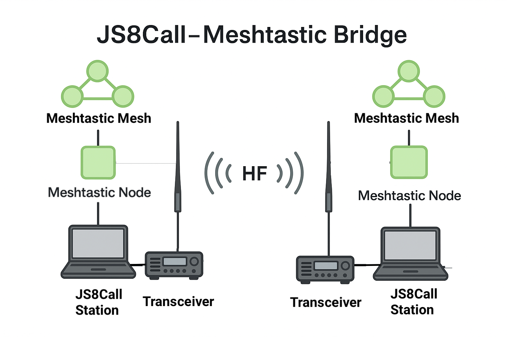

# QXT Meshtastic Bridge (JS8stastic)

It connects to JS8Call’s TCP/UDP JSON API with a Meshtastic Node, forwards any received JS8Call messages addressed to your callsign or your monitored groups to a chosen Meshtatic Node, and lets you transmit back from Meshtastic using simple commands.




## Options
### Core switches

Enables the JS8 → Meshtastic direction. If false, JS8 messages are ignored:
```
--enable-j2m (default: true, choices: true|false)
```

Enables the Meshtastic → JS8 direction. If false, mesh messages are ignored:
```
--enable-m2j (default: true, choices: true|false)
```

### JS8Call I/O (listening side for J2M)

How the listener reads JS8Call events (TCP socket vs UDP socket):
```
--js8-mode (default: tcp, choices: udp|tcp)
```

The IP/interface where JS8Call exposes its API/events:
```
--js8-host (default: 127.0.0.1)
```


The TCP/UDP port JS8Call uses for API/events (matches JS8Call settings):
```
--js8-port (default: 2442, int)
```

### JS8Call sender (M2J transmissions out to JS8)

If set, use a different host for sending commands to JS8Call:
```
--js8-send-host (default: same as --js8-host)
```

If set, use a different port for sending commands to JS8Call:
```
--js8-send-port (default: same as --js8-port, int)
```


Background “liveness” pings to keep the TCP sender healthy and reconnect if needed:
```
--js8-heartbeat (default: 30, seconds; 0 = off)
```

### Meshtastic connection

Serial device path for direct Meshtastic connection (e.g., /dev/ttyUSB0, COM6). If provided, it’s used instead of TCP:
```
--meshtastic-serial (default: None)
```

Connects to Meshtastic over TCP to that node. Required if --meshtastic-serial is not set:
```
--meshtastic-host (default: None, format: IP[:PORT], default port 4403)
```


### Routing rules (JS8 → Mesh)

For JS8 texts containing @TAG, also send to the specified Meshtastic channel (name or index).
```
--route-chan TAG=ChannelName|Index (repeatable)
```

Example: 
```--route-chan alert=0 --route-chan ops=Operations```


For JS8 texts containing @TAG, also send direct to a node (by ShortName or explicit !NodeId):
```
--route-node TAG=ShortName|!Id (repeatable)
```
Example:
```
--route-node nod1=NOD1 --route-node base=!ABCD1234
```


### J2M filtering and formatting (JS8 → Mesh)

Only forward JS8 texts that contain this @TAG (case-insensitive). Others are ignored:
```
--only-tag (default: None)
```

When forwarding, remove the @TAG from the message body instead of keeping it:
```
--strip-tag (flag)
```

Default Meshtastic destination node ID (!Id) for JS8 texts when no routing rule matches:
```
--dest-id (default: None)
```

Default Meshtastic destination by ShortName (resolved to node ID) for JS8 texts:
```
--dest-shortname (default: None)
```

Default channel index to post into when no routing rule matches:
```
--channel-index (default: None, int)
```

Default channel name to post into when no routing rule matches:
```
--channel-name (default: None)
```

Prefix prepended to messages going from JS8 to Mesh (helps avoid loops/echo):
```
--prefix (default: [JS8])
```


### ACK handling (Mesh side)

When sending to a specific node on Meshtastic, request an ACK and track its timeout:
```
--want-ack (flag)
``` 

How long to wait before declaring an ACK timeout in the log:
```
--ack-timeout (default: 30, seconds)
```

### M2J targeting & filtering (Mesh → JS8)

Where mesh messages go in JS8 by default:
```
--m2j-to (default: @ALLCALL)
```

@ALLCALL → “free text” broadcast (tries API ALLCALL, then UI fallback)

CALLSIGN → directed message to that JS8 station (TX.SEND_MESSAGE)

Prefix added to text forwarded from Mesh to JS8 (for context/loop-avoidance):
```
--m2j-prefix (default: [mesh] )
```

Max characters for forwarded mesh text (longer texts are truncated with …):
```
--m2j-maxlen (default: 200, int)
```

Allow forwarding packets you originated yourself (by default, self-messages are suppressed):
```--m2j-allow-self``` (flag)

Only accept mesh messages from certain senders. Each token can be:

!NodeId (full ID), hex suffix like EF01 (matches node IDs ending in that suffix), a ShortName (e.g., NOD1).

```
--m2j-only-from (default: none; space-separated list)
```

Special handling: if a mesh text starts with @@CALL …, it becomes a literal @CALL … free text in JS8 (i.e., it will not be treated as directed; one @ is “escaped”).
```
--m2j-escape-at (flag)
```

###Logging


Global verbosity for the whole bridge.
```--log-level (default: INFO, choices: DEBUG|INFO|WARNING|ERROR)```

How routing works (quick mental model)

### JS8 → Mesh (J2M)

Script looks for an @TAG in the JS8 text (after stripping a leading “CALLSIGN: ” if present).

If --only-tag is set, other tags are ignored.

The forwarded message is built as "{prefix} {FROM}: @{tag} {body}" or, with --strip-tag, "{prefix} {FROM}: {body}".

It is then sent to:

Every --route-node TAG=... match (direct to node),

Every --route-chan TAG=... match (to channel),

Else to the default destination (any of dest-id / dest-shortname / channel-index / channel-name if provided).

### Mesh → JS8 (M2J)

If the mesh text starts with @@CALL … and ```--m2j-escape-at``` is on → send literal @CALL … as free text.

Else if it starts with @CALL … → send a directed JS8 message to CALL, body is the remainder.

Else → send as free (@ALLCALL) or directed per --m2j-to.

## Practical examples:

Bridging JS8Call to Meshtastic and viceversa, using TCP/IP for JS8Call station and for the Meshstastic node:
```
python bridge.py --enable-j2m true --enable-m2j true \
  --meshtastic-host 192.168.1.11:4403 --m2j-to "@11ABC11" \
  --m2j-prefix "[mesh] " --m2j-only-from NOD1  --js8-host 127.0.0.1 \
  --js8-port 2442 --route-node nod1=NOD1 --want-ack --m2j-escape-at --log-level INFO
```


Basic both-ways bridge over TCP Meshtastic, broadcast to JS8 ALLCALL
```
python js8static.py \
  --meshtastic-host 192.168.1.50:4403 \
  --enable-j2m true --enable-m2j true \
  --m2j-to @ALLCALL --log-level INFO
```

Route JS8 @ops to channel “Operations” and @base directly to node shortname QXT3
```
python js8static.py \
  --meshtastic-host 192.168.1.50 \
  --route-chan ops=Operations \
  --route-node base=QXT3
```

Only accept mesh messages from node suffix EF01 and literal-escape @@CALL
```
python js8static.py \
  --meshtastic-host 192.168.1.50 \
  --m2j-only-from EF01 \
  --m2j-escape-at
```

Default J2M target: channel index 0, strip the tag, and request ACKs to a specific node
```
python js8static.py \
  --meshtastic-host 192.168.1.50 \
  --only-tag alert --strip-tag \
  --dest-id !ABCD1234 --want-ack --ack-timeout 45
```

