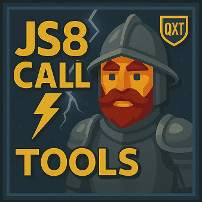

# QXT JS8Call Tools

<!-- Badges -->

QXT JS8Call Tools is a collection of small, service-friendly Python scripts that talk to JS8Call’s JSON API to streamline common tasks and add operator conveniences. All tools are cross-platform (Windows/Linux/macOS), use only the Python libraries, and are easy to run under systemd or Windows Task Scheduler.

Requirements: Python 3.8+.

Scripts:
- [SNR-Beacon](https://github.com/QuixoteSystems/QXT-JS8Call-Tools/tree/main/SNR-Beacon): sending periodic SNR? to a group (with an immediate first TX), simple relays, and lightweight logging of activity. 

- [Telegram-Bridge](https://github.com/QuixoteSystems/QXT-JS8Call-Tools/tree/main/Telegram-Bridge): sending and receiving messages from your JS8Call station in your Telegram App.

- [Frequency-Scheduler](https://github.com/QuixoteSystems/QXT-JS8Call-Tools/tree/main/Frequency-Scheduler): change the frequency of your radio automacticlly on a scheduled schedule. (Obsiously it needs CAT control configured in JS8Call).

- Meshtastic-Bridge: work in progress...

  
If you like this work:

